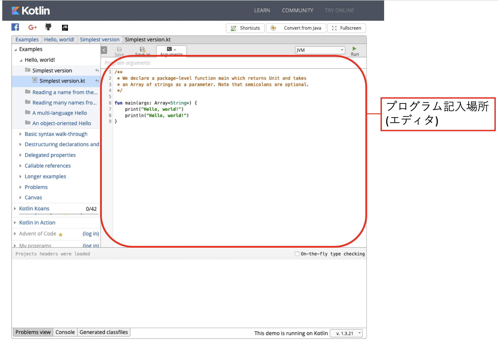
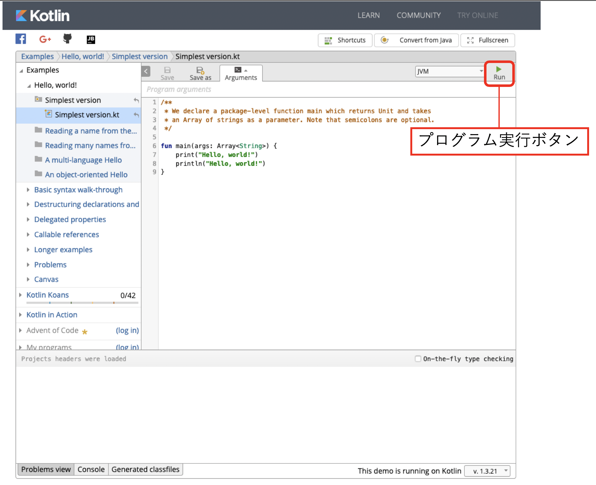
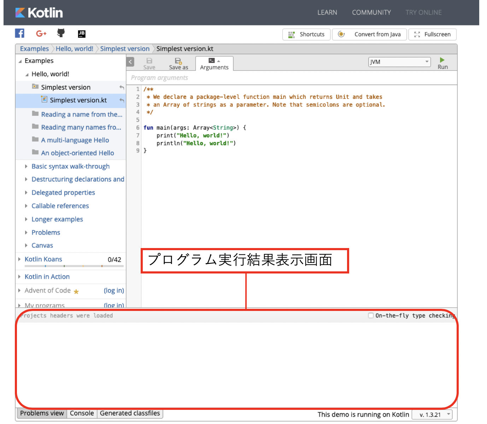

# 目次
- はじめに
- 想定読書
- 環境
- プログラミングとは
- オブジェクト指向という概念
- 基本構文
  - 変数
  - 文字列
  - 関数・メソッド
  - クラス
  - 入出力
  - 条件分岐
  - 繰り返し
- Kotlinでのオブジェクト指向
# 本題

# はじめに
## Kotlinとは
KotlinとはJetBrains社が開発したオブジェクト指向プログラミング言語です。  
Java言語との互換性が非常に高く、Javeで作成されたプログラムをKotlinから呼び出したりその逆も然りできます。  
ですので、同じプロジェクト内で一部はKotlin、残りはJavaのようなこともできます。  
基本的にはJavaで出来ることはKotlinでも出来る(はず)なので、今までJavaで作られていたものを作ることが可能です。  
### 読み方
「ことりん」です。  
発音の仕方は、個人的には「ことりん(→)」だと思っていたんですけど、「こっ(↑)とりん(↓)」と呼んでいる人の方が圧倒的に多くてどっちなんだろうとお気持ちです。  

## 断り
この資料では、わかりやすく説明するために、実際とは少し意味が異なった表現をしている場合がありますが、ご了承ください。  
明らかに違うと言ったことやこの表現の方が適切等ありましたら意見ください。:pray:  

# 想定読者
想定としてはプログラミングを始めたばかり・これから始めるという人でもKotlinに触れプログラミングのいろいろを知れるような内容にしていきたいと思っています。
少なくとも、何かのプログラミング言語を経験している人ならスムーズに話がわかるかなと思います。

# 環境
環境構築の方法は[こちら](https://kotlinlang.org/docs/tutorials/command-line.html)にあります。  
環境構築を行うことでターミナル上でKotlinを動かすことができますが、今回は環境構築に関する説明は詳しく行いませんので各自でお願いします。  
Homebrew等でコマンド一つで構築できる場合もあります。  

環境構築を行わなくてもKotlinの動作を試す方法として今回は[こちら](https://try.kotlinlang.org/#/Examples/Hello,%20world!/Simplest%20version/Simplest%20version.kt)を使用します。  
動作検証も上記で行なっています。  

## 操作方法
### 画面説明




プログラムを記入する部分やソフトをエディタといいます。  
エディタにも多くの種類があり機能の多さやカスタムのしやすさなどなどで、メモ帳からVisualStudioまで色々なものがあります。  
このエディタ部分にプログラムを記入し、プログラム実行ボタンを押して実行しプログラム実行結果画面でその結果を確認できます。  

# 基本構文
## 変数
プログラム中で値を保管したいときなどに用いられる変数と呼ばれるものについて話します。  
変数定義の仕方は以下のようになってます。  
```kotlin
var a: Int = 0 
var b: String?
val c: Long = 100L

var d = 200f // 型省略可能
```
構文としては  
`var(val) 変数名: 型名`  
です。  
まず最初に、`var`もしくは`val`を書きます。  
このどちらともこれから変数を定義します。という意味を持つのですが、その変数の種類が少し違います。  
varは再代入可能な変数で、何度もこの変数に値を代入することができます。  
valは再代入不可な変数で、一度(変数定義時など)のみ代入可能です。  

その次に、変数名を書きます。  
変数名は基本的にはなんでもいいです()。  
ただ、頭文字が数字であったりKotlinで既に使われている名前だったり他の変数などと同じ名前だったり記号が入っていたりするとコンパイルエラーになります。  
変数名はキャメルケースでつけられることが多いです。  

変数名の後に`: 型名`を付けます。  
型には、Int(整数),Float(小数),String(文字列)などがあります。  
https://dogwood008.github.io/kotlin-web-site-ja/docs/reference/basic-types.html  
型はいろいろありますが、その中に型名の後に?が付いている型があります。  
これは何を表しているかというとこの変数の型はnullable型、nullを代入可能な変数ということを表しています。  
付いていない型の変数にはnullを入れることはできません。  
nullについては[ここ](http://e-words.jp/w/Null.html)を見てください

また、この型は=の右辺の型が確定している場合に限り省略することが可能です。  

変数宣言時に型の後に=と値を記入することで、宣言と同時に値の代入が可能です。  
代入している場合に限り変数の型宣言を省略することができます。  
例で、100Lや200fなどがありますが、これをつけることによって整数を少数として扱ったりLongとして扱ったりできます。  

## 文字列
文字列もKotlinでは扱えるのですが、少し扱いが特殊なことができるので特筆します。  
まず、Kotlinで文字列を扱う際は`"`で囲みます。  
例->"Hello, Kotlin!"  
基本的に大抵の文字や記号は使用できます。  

### 文字列リテラル
""で囲まれているものを文字列リテラルと言います。  
この文字列の中で変数を展開したいときは(例えば、"a=10"など)  
展開したい場所で、展開したい変数名を書いてその前に`$`をつけます。  
```kotlin
var a = 10
"a=$a"
```
もし、変数だけでなく変数内のメソッドなどを使用して文字列内に埋め込みたいときは  
$の後に`{}`をつけてその中に記述します。  
```kotlin
var hoge = Hoge()

"hoge=${hoge.poyo}"
```


## 関数・メソッド
Kotlinには関数・メソッドと呼ばれるものが存在し、この中にプログラムを書いて呼び出し、実行することができます。  
使い方等によって関数と言ったりメソッドと言ったりしますが、この章では関数と呼びます。  
一番簡単な関数の例はこのようになっています。  
```kotlin
fun sum(var a: Int, var b: Int): Int = a + b

// 使う側
sum(3, 2)
// => 5
```
この関数は二つの渡された値の加算を行い、その答えを呼び出し元に返します。  

では、一つ一つ紹介していきます。
### `fun`
まず、一番最初の単語である `fun`、これは、関数を定義する際に必要な文でこれから関数を定義(用意)しますよという意味です。  
### `sum`
次に`sum`、これは関数名を表します。先ほどの`fun`で用意する関数はsumっていう名前ですよというのを表しています。  
今回は、加算を行う関数を作りたかったのでsumという名前にしましたが、関数名は基本的には自由につけることができます。  
使えないのは予約語と呼ばれるKotlinがすでに使っている名前(例えば、先ほどのfunなど)や数字や記号から始まる名前などです。(これまた例外で使う方法もありますが今は割愛)  
アルファベットの大文字から始めることなどもできますが、慣習的に関数名は小文字を頭文字にします。  
### `(var a: Int, var b: Int)`
これは、関数の引数と呼ばれるものを定義しています。  
引数とは、呼び出し元からその関数に渡して、その関数内で使うことのできるものです。  
今回の例では、Int型の引数a,bと二つ定義しています。  
この関数に対して呼び出す側が、`sum(3, 2)`とすることで、a,bそれぞれに対して3,2が代入され、sum関数内で使用可能になります。  
### `: Int`
これは返り値という呼び出し元に返す値の肩を定義しています。  
この関数自体の型とも言えます。  
こうすることによってsumという関数はIntという値が関数の実行結果として返ってきますよとしています。  
### `=`
これは、左辺で定義した関数の中身は右辺ですよということを定義しています。  
なので、このsumという関数の中身は`a + b`になります。  
このsum関数を実行すると`a + b`が実行されその結果が返ってきます。  

### Unit
```kotlin
fun do(): Unit {
  // do something
}
fun do() { // 省略可能
  // do something
}
```
doという関数を用意してみました。  
上の方のdo関数なのですがUnitという型を返します。  
このUnitというのは、意味のないものを返しますよというやつです。  
簡単にいうとこの関数では返り値がないということを表しています。  
実は、この2つのdo関数は同じ意味を表しています。  
先ほど、説明したUnitというのは意味のないものと言いました。  
意味のないのなら書く必要もないということで省略が可能です。  
通常、Unitは省略するのが推奨されています。  

## クラス
Kotlinではオブジェクト指向によって書かれます。  
オブジェクト指向に関しては後で記入します。  
そのため、クラスを主に使います。  
このクラスは、メソッドとメンバ変数を持つことができます。  
クラスの定義の仕方は以下のようになっています。  
```kotlin
class Hoge {
  var a: int = 0
  fun foo() {
  }
}
// 継承あり
class Hoge : Poyo {

}
// クラスに引数を渡したいとき
class Hoge(
    a: Int,
    val b: Int
) {
}
// 継承と引数あり
class Hoge(a: Int): Poyo {}
```
また、何もしない(メソッドを持たない)データを保持するためだけのクラスを定義したいときは以下のように行います。  
```kotlin
data class Data(
  var a: Int = 0,
  var b: String = "",
  var isOk: Boolean
)
```

では、一つ一つ紹介していきます。  
### `class` 
クラスを定義する際に必ず必要で、これからクラスを定義しますよということを宣言します。  
### `Hoge`
これはクラス名を表しています。名前は関数名の時と同様に数字や記号が頭文字に来る・予約語でなければなんでも使えます。  
慣習的に頭文字を大文字にする場合が多いです。  
### `{}`
このカッコ内がクラスの中身になります。  
クラスの中身に記入可能なのはメソッドとメンバ変数です。  
### 継承あり
クラス作成時に他のクラスやインターフェース(後述？)を継承したいときはクラス名の後に`:`、そして継承したいものの名前を書きます。  
服すす継承したいときはカンマ区切りで:の後に書いていきます。  
### 引数あり
引数をクラスに渡したいときは、クラス名の後に()を書いてその中に引数を書いていきます。  
var付きと無しがあると思いますが、その違いはコンストラクタ(後述)のみでしか使えないのかこのクラス内であればいつでも使えるのかの違いです。  
var付きがこのクラス内であればいつでも使えます。扱いとしてはvarを付けるとこのクラスのメンバ変数になるようなイメージです。  
### コンストラクタ
コンストラクタというのはクラスがインスタンス化された瞬間に実行されるメソッドのようなものです。  
主に、値の初期化などが行われます。  
Kotlinでは以下のように書きます。  
```kotlin
// ただクラスがインスタンス化されたときに初期化したいとき
class Foo {
  var a: Int = 10
  val b: String = "Kotlin"
}

// クラスがインスタンス化された時にメソッドを呼びたいとき
class Foo {
  init {
    bar()
  }
  
  fun bar() {
  // do something
  }
}

// 渡された値をクラスのメンバにしたいとき
class Foo(val a: Int, var b: String)

// 渡された値を加工してクラスのメンバ変数に代入したいとき
class Foo(a: Int) {
  var b = a + 10
}
```

## 標準入出力
### 入力
一旦保留で  

### 出力
ターミナルなどに標準出力を行う際は以下のコードが使われます。
```kotlin
print("hoge")
println("hoge")

a = 10
println(a)
// => hogehoge
// => 10
```

2つのコードの違いは出力後に改行を行うかどうかです。  
`print`はただ出力するだけで出力後の改行は行いません。  
`println`は出力後に改行を行います。  
printの()の中に、文字列リテラルや変数、指揮などを代入することで出力が可能です。  
文字と変数の中身を一度に出力したいときは以下のように行います。  


```kotlin
a = 10
println("value is $a")
// => value is 10
```

## 条件分岐
プログラムでは、入力や状態に合わせて処理を分けるときが多くあります。  
その際に使われるのが条件分岐です。  
Kotlinでは以下のように書きます。  
```kotlin
if (1 == 2) {
} else {
}

if (a == 1) {
} else if (a == 2) {
} else {
}
```
構文としては、ifの後の括弧の中に処理を分ける判断基準になる条件文を書きます。  
上の例では、1 == 2などのように書かれています。  
1 == 2は1と2が等しいかどうかを判断しています。(この場合は偽)  
条件式に使えるのは、`==`,`<`,`>`,`=>`,`=<`,`in`などです。  
それぞれに関して説明を行うと、  
==は右辺と左辺の値が等しいかどうかを判断します。  
<は左辺より右辺の方が大きいかどうかを判断します。  
>は左辺より右辺の方が小さいかどうかを判断します。  
=>は左辺が右辺以上かどうかを判断します。  
=<は右辺が左辺以上かどうかを判断します。  
inは左辺の値が右辺に含まれているかどうかを判断します。  
inはKotlin固有のものですが、他のものは他の言語でも大体一緒です。  

条件分岐にはif以外にもwhenというものがあります。  
```kotlin
when(a) {
  1 ->
  2 -> {
  }
  3, 4 -> {
  }
  a is String -> {
  }
  else ->
}

when {
  a == 2 ->
  b < 4 ->
}
```
のように使います。  
whenの後の丸括弧内に変数を書くことで、その変数の値を元に{}内の条件に当てはまるか見ていきます。  
`1 ->`というのはaが1かどうか判断しています。もし、aが1ならば`->`の右側の処理を実行します。この書き方の場合、処理は1行分しか書けません。  
2も同様なのですが、`->`の後が{}になっています。こうすることによって処理を複数行かけるようになります。  
次に、`3, 4 ->`ですが、これはaが3か4かどちらかかと判断しています。こうすることによって同じ処理をする条件式をまとめたりできます。  
`a is String`は変数aの型がStringかどうか判断しています。  
`else ->`は、このelseより上の条件に何も引っかからなかった時に実行されます。  

下の方のwhenなのですが、whenの後の丸括弧がありません。ですがちゃんと動きます。  
こうすることによってある変数を元に条件を判断するのではなく、複数の変数を用いて複数のいろんな条件式をwhenですることができます。  
